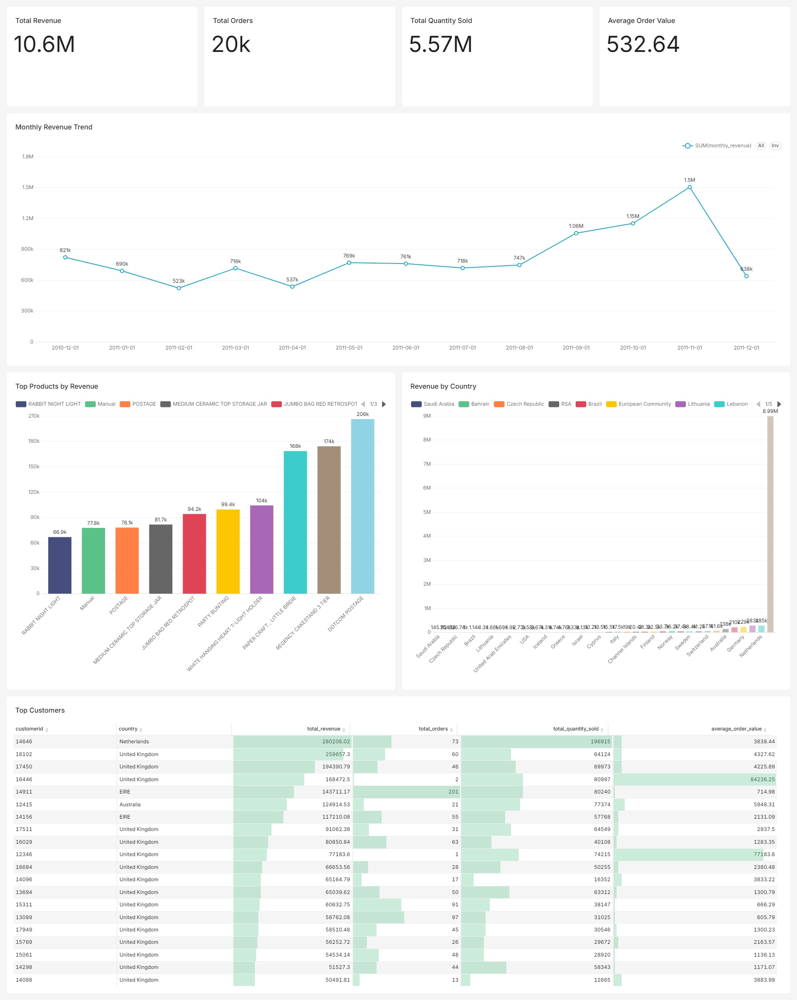

# Sales Data Cleanup & Executive Dashboard

## Project Overview

This project simulates a real-world client BI task: cleaning messy sales transaction data and converting it into an executive dashboard.

The goal was to start from raw transactional sales data, identify data quality issues, clean and transform the dataset, calculate business KPIs, run SQL analysis, load dashboard-ready tables into PostgreSQL, and build an executive dashboard in Apache Superset.

This project is designed as a portfolio case study for data analytics, BI, SQL, and dashboard development work.

---

## Business Objective

A business stakeholder wants a clean executive view of sales performance.

The dashboard should answer:

* What is the total revenue?
* How many orders were placed?
* What is the total quantity sold?
* What is the average order value?
* Which months generated the most revenue?
* Which products generated the most revenue?
* Which countries contributed most to sales?
* Who are the top customers by revenue?

---

## Dataset

**Dataset:** UCI Online Retail Dataset
**Source:** UCI Machine Learning Repository
**Business Context:** Online retail transactions for a UK-based e-commerce company.

The original dataset contained sales transactions, product information, invoice numbers, quantities, prices, customers, countries, and invoice dates.

---

## Tools Used

| Tool             | Purpose                                 |
| ---------------- | --------------------------------------- |
| Python           | Data processing and automation          |
| Pandas           | Data cleaning and transformation        |
| Jupyter Notebook | Step-by-step analysis documentation     |
| DuckDB           | Local SQL analysis on cleaned CSV files |
| PostgreSQL       | BI-ready database layer                 |
| SQLAlchemy       | Loading processed data into PostgreSQL  |
| Apache Superset  | Executive dashboard creation            |
| Git/GitHub       | Version control and portfolio hosting   |

---

## Project Workflow

```text
Raw Excel Dataset
        ↓
Python/Pandas Data Inspection
        ↓
Data Quality Report
        ↓
Data Cleaning Rules
        ↓
Processed Clean Datasets
        ↓
DuckDB SQL Analysis
        ↓
Dashboard Summary Tables
        ↓
PostgreSQL Loading
        ↓
Apache Superset Dashboard
```

---

## Repository Structure

```text
sales-cleanup-executive-dashboard/
│
├── data/
│   ├── raw/                  # Raw dataset ignored from GitHub
│   ├── processed/            # Cleaned and dashboard-ready datasets
│   │   └── dashboard/        # Summary tables for dashboard
│
├── notebooks/
│   ├── 01_data_inspection.ipynb
│   ├── 02_data_cleaning.ipynb
│   └── 03_sql_analysis_duckdb.ipynb
│
├── reports/
│   ├── data_quality_summary.csv
│   └── images/               # Dashboard screenshots and PDF export
│
├── scripts/
│   └── load_dashboard_data_to_postgres.py
│
├── sql/
│   ├── 01_executive_kpis.sql
│   ├── 02_monthly_revenue.sql
│   └── 03_top_products.sql
│
├── requirements.txt
├── .gitignore
└── README.md
```

---

## Data Quality Findings

Initial inspection found several data quality issues:

| Issue                        | Business Impact                                      |
| ---------------------------- | ---------------------------------------------------- |
| Missing Customer IDs         | Cannot use those rows for customer-level analysis    |
| Missing Product Descriptions | Product-level reporting may be affected              |
| Duplicate Rows               | Can inflate revenue, orders, and quantity sold       |
| Negative Quantities          | Usually cancellations, returns, or stock adjustments |
| Zero Unit Price              | May represent free items or non-sales transactions   |
| Accounting Adjustments       | Should not be included in sales KPIs                 |

Instead of blindly deleting rows, the data was separated into clear business datasets.

---

## Cleaning Rules Applied

The cleaned dataset was created using these rules:

### Clean Sales Dataset

Included records where:

* Transaction type is `Sale`
* Quantity is greater than 0
* Unit price is greater than 0
* Revenue is greater than 0
* Accounting adjustment records are excluded

### Returns/Cancellations Dataset

Included records where:

* Invoice number starts with `C`
* Quantity is negative
* Revenue is negative

### Excluded Records Dataset

Included records that were not valid sales or returns, such as:

* Zero-price records
* Missing product description with no revenue
* Accounting adjustment rows
* Other non-sales records

This preserves an audit trail instead of silently deleting questionable records.

---

## Final Executive KPIs

| KPI                 |   Value |
| ------------------- | ------: |
| Total Revenue       |  10.63M |
| Total Orders        |  19,959 |
| Total Line Items    | 524,877 |
| Total Quantity Sold |   5.57M |
| Average Order Value |  532.64 |

---

## SQL Analysis

SQL was used to calculate:

* Executive KPIs
* Monthly revenue trend
* Top products by revenue
* Revenue by country
* Top customers by revenue

Example KPI query:

```sql
SELECT
    ROUND(SUM(revenue), 2) AS total_revenue,
    COUNT(DISTINCT invoiceno) AS total_orders,
    COUNT(*) AS total_line_items,
    SUM(quantity) AS total_quantity_sold,
    ROUND(SUM(revenue) / COUNT(DISTINCT invoiceno), 2) AS average_order_value
FROM clean_sales;
```

---

## Dashboard

The final dashboard was built in Apache Superset.

### Dashboard Preview



### Dashboard Sections

* Executive KPI cards
* Monthly revenue trend
* Top products by revenue
* Revenue by country
* Top customers by revenue

---

## Key Business Insights

1. **Total sales revenue reached 10.63M** after cleaning invalid, duplicate, and non-sales records.
2. **November 2011 was the strongest sales month**, showing a major revenue spike before the incomplete December period.
3. **The United Kingdom contributed the majority of revenue**, which is expected because the business is UK-based.
4. **A small group of customers generated very high revenue**, making top-customer analysis useful for retention and account management.
5. **Some records looked like sales but were actually accounting adjustments**, proving why data validation is critical before KPI reporting.
6. **Returns, cancellations, and excluded records were separated**, allowing cleaner executive KPIs while preserving auditability.

---

## How to Reproduce

### 1. Clone the repository

```bash
git clone https://github.com/FawadUlHassan/sales-cleanup-executive-dashboard.git
cd sales-cleanup-executive-dashboard
```

### 2. Create Python environment

```bash
python3 -m venv .venv
source .venv/bin/activate
```

### 3. Install dependencies

```bash
pip install -r requirements.txt
```

### 4. Download raw dataset

Download the UCI Online Retail dataset and place the Excel file in:

```text
data/raw/Online Retail.xlsx
```

### 5. Run notebooks

Run the notebooks in order:

```text
01_data_inspection.ipynb
02_data_cleaning.ipynb
03_sql_analysis_duckdb.ipynb
```

### 6. Load dashboard tables into PostgreSQL

Update the database connection string in:

```text
scripts/load_dashboard_data_to_postgres.py
```

Then run:

```bash
python scripts/load_dashboard_data_to_postgres.py
```

### 7. Build Superset dashboard

Connect Apache Superset to PostgreSQL and create charts using the tables in the `sales_dashboard` schema.

---

## Portfolio Value

This project demonstrates practical skills in:

* Data cleaning
* Data quality analysis
* KPI calculation
* SQL analytics
* PostgreSQL loading
* BI dashboard development
* Business insight generation
* GitHub-based project documentation


